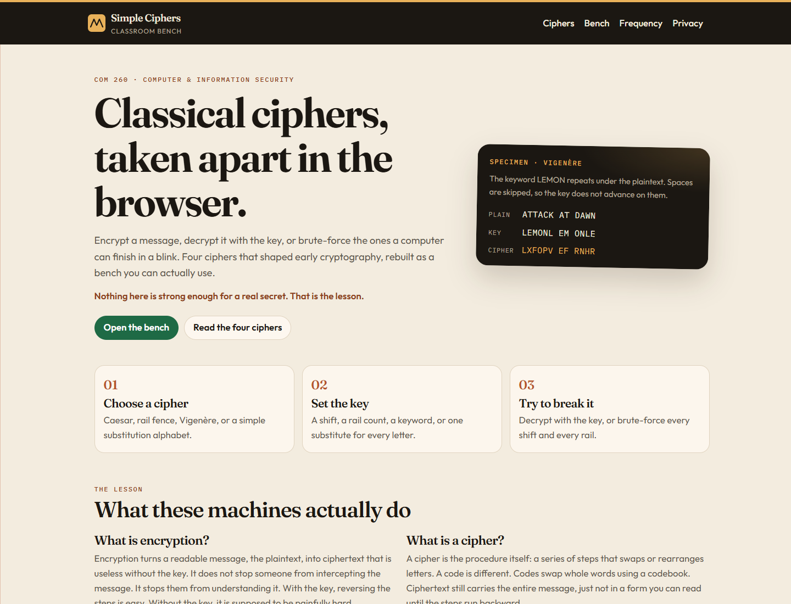
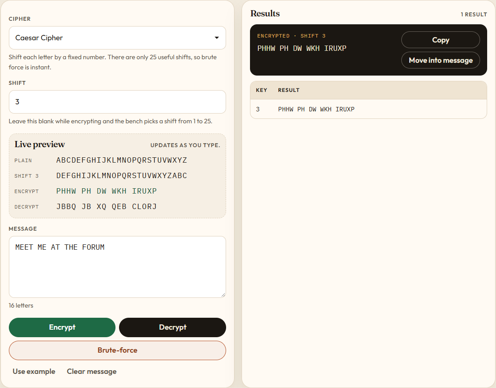
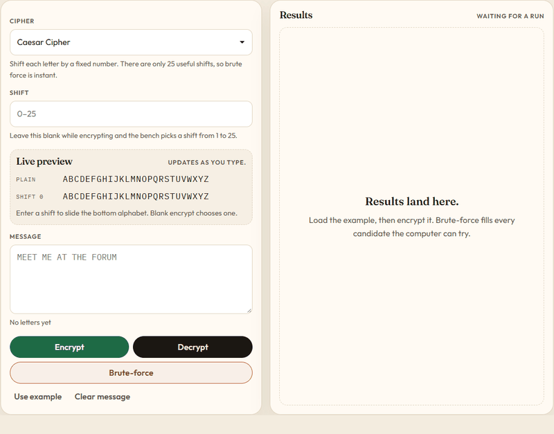
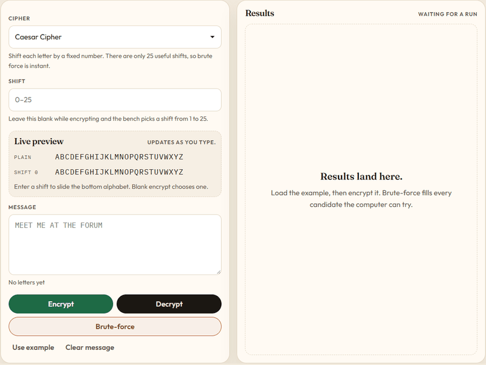
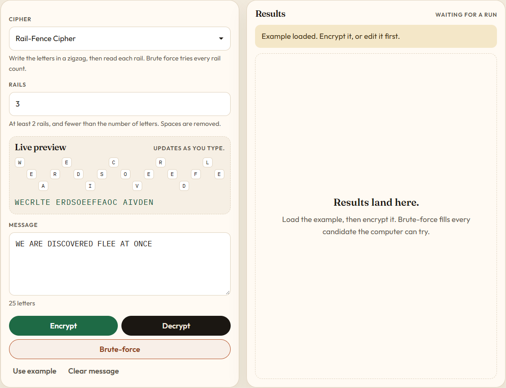
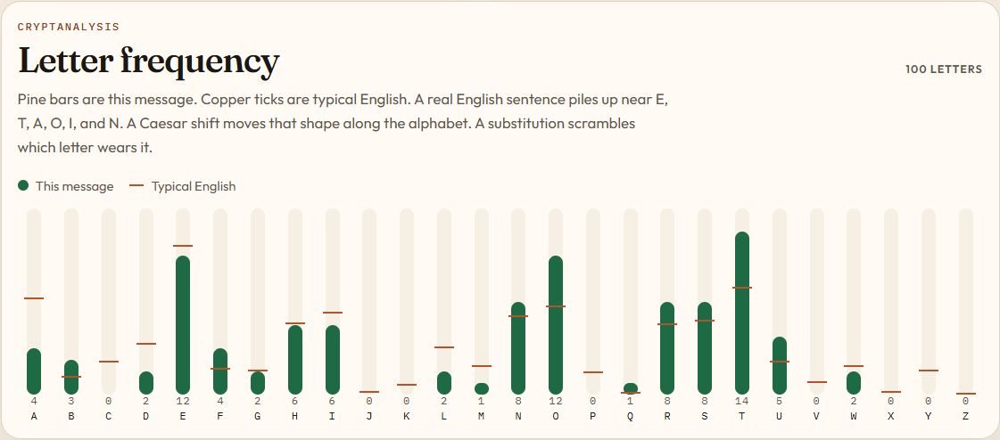
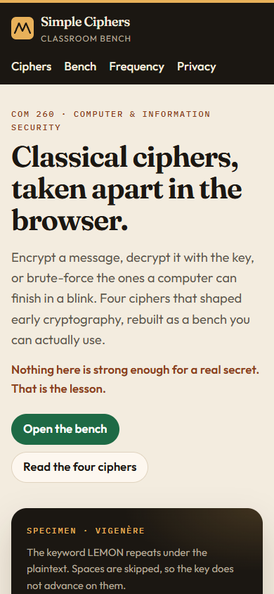
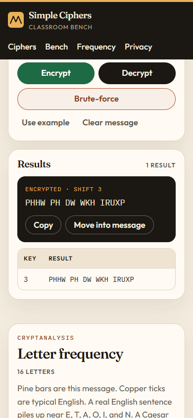
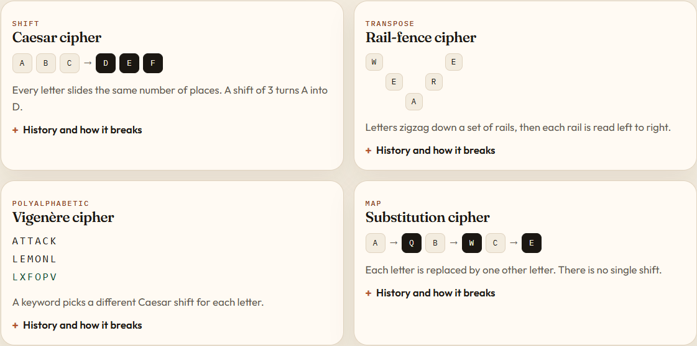

# Simple Ciphers
[](LICENSE)

**Live site:** [https://jaredscar.github.io/SimpleCiphers/](https://jaredscar.github.io/SimpleCiphers/)

Simple Ciphers is a browser bench for four classical ciphers, made for Sister Jane Fritz’s COM 260 Computer & Information Security class. Encrypt a message, decrypt it with the key, or brute-force the ciphers a computer can finish in a blink. The work stays in the browser. GitHub Pages publishes the `master` branch.



## Open it

Open `index.html` in a browser, or serve the folder:

```bash
python -m http.server
```

The class site was originally published at [simpleciphers.tk](http://simpleciphers.tk).

## The bench

Pick a cipher, set the key, and the live preview updates as you type. Letters are transformed. Spaces and punctuation stay put, except on the rail fence, which drops them before the zigzag is written.



### Encrypt and decrypt

**Encrypt** runs the cipher forward. **Decrypt** runs it backward with the key in the box. **Move into message** copies a result into the message box so you can crack what you just encrypted. **Use example** loads a known plaintext and key for the cipher you have selected.

### Brute force

Caesar has 25 useful shifts. The rail fence has one rail count to find. Both can be searched outright. The readable English row is the plaintext.



Vigenère repeats a keyword under the plaintext. The bench decrypts it when you already know the keyword. It does not search every possible word.



A simple substitution needs the full 26-letter alphabet. Leave the key blank and Encrypt invents a reversible one. There are 26 factorial possible alphabets, so this bench will not search them.

### Rail fence

Letters zigzag down the rails, then each rail is read left to right. The preview draws that path before you encrypt.



### Letter frequency

Pine bars are this message. Copper ticks are typical English. A real English sentence piles up near E, T, A, O, I, and N. A Caesar shift slides that shape along the alphabet. A substitution keeps the shape and parks it on the wrong letters.



### On a phone

The same bench stacks on a narrow screen. Results sit under the buttons you just pressed.





## Included ciphers



### Caesar cipher

The Caesar cipher is one of the simplest and most widely known encryption techniques. It shifts every letter by the same amount. A right shift of 3 turns each A into D. Julius Caesar used it in private correspondence, which is where the name comes from. The key is the size of the shift. There are only 25 useful shifts, so a computer can try them all in milliseconds. In modern practice it offers no communications security.

### Rail-fence cipher

The rail-fence cipher, sometimes called the zigzag cipher, is a transposition cipher. The name comes from the path the letters take: up and down a set of rails, then each rail is read across. The key is the number of rails. It has to be at least 2, and no more than the number of letters. That is a small search, so the cipher is weak enough to solve by hand.

### Vigenère cipher

The Vigenère cipher weaves several Caesar ciphers together, one for each letter of a keyword. It is easy to understand, and it resisted a clean public attack for about three centuries. In 1863 Friedrich Kasiski published one. Repeated words are sometimes encrypted by the same key letters, which leaves repeated groups in the ciphertext. The distance between those groups suggests the key length.

With a normal alphabet the math is commutative. If the key length is known, or guessed, subtracting the ciphertext from itself at that offset peels the key away. A probable word in the plaintext makes that easier, and short messages give the attack more to hold onto. Brute-forcing the keyword itself is a different problem. This bench decrypts Vigenère only when the keyword is already known.

### Substitution cipher

A simple substitution cipher replaces every letter with one other letter: A might become Q, B might become W, and so on. There is no single shift. The key is the whole alphabet, and you need every letter of it to reverse the message. The cipher is still weak. English letters do not appear equally often.

The usual attack is frequency analysis. Guess the common letters, form partial words, and the rest of the key starts to give way. The chart on the bench is there for that comparison.

## Privacy

Messages, keywords, and alphabet keys are processed locally. The page has no account, no analytics, and no ads. Typefaces load from Google Fonts, so that request shares an IP address with Google. Details are in [privacy.html](privacy.html).

## License

[MIT](LICENSE)
